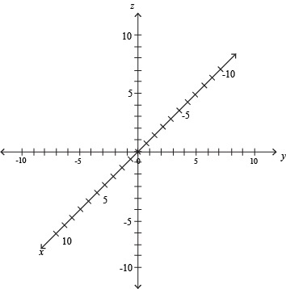
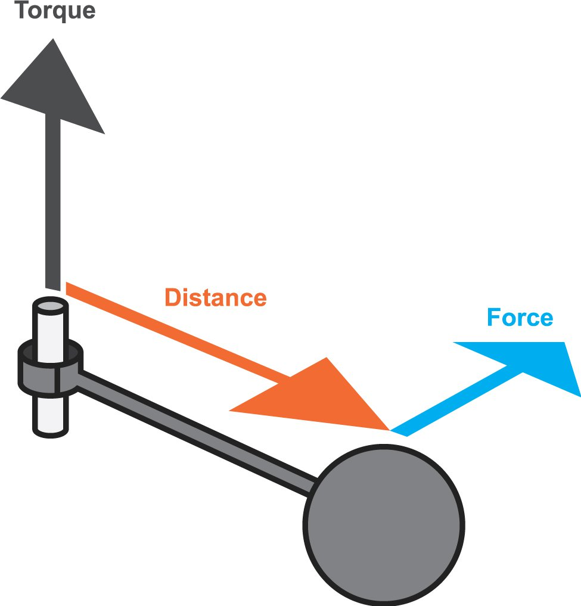
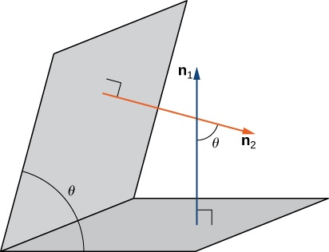



# 3D Space and Vectors

<!--https://en.wikipedia.org/wiki/Cross_product-->

## Learning Targets

You should be able to

### Part 1
- [ ] Plot points and graph planes
- [ ] Evaluate midpoint and distance of points
- [ ] Write equations of spheres
- [ ] Write vectors (component form / linear combination form)
- [ ] Find the unit vector
- [ ] Evaluate the dot product
- [ ] Write parametric / vector equations of lines

### Part 2
- [ ] Evaluate the angle between vectors
- [ ] Evaluate the cross product
- [ ] Write the equation of a plane
- [ ] Find the angle between planes
- [ ] Find the equation of the line of intersection of two planes
- [ ] Find the distance between a point and a plane

## Concepts / Definitions

### Plotting points in 3D

Sketch gridlines in the $xy$ plane and vertically to a point to show perspective. *Make sure they are parallel.* Right-hand rule axis.

### Graphing a plane

Plot intercepts, sketch the "triangle" which represents a plane in one octant.

The **distance** $d$ between the points $P(x_1, y_1, z_1)$ and $Q(x_2, y_2, z_2)$ is
$$d = \sqrt{(x_2 - x_1)^2 + (y_2 - y_1)^2 + (z_2 - z_1)^2}$$

The **midpoint** $M$ of line segment $PQ$ with endpoints $P(x_1, y_1, z_1)$ and $Q(x_2, y_2, z_2)$ is
$$(M_x M_y M_z) = (\frac{x_1 + x_2}{2}, \frac{y_1 + y_2}{2}, \frac{z_1 + z_2}{2})$$

The **equation of a sphere** with point $P(x, y, z)$ on the sphere and center $(h, k, l)$ and radius $r$ is
$$(x-h)^2 + (y-k)^2 + (z-l)^2 = r^2$$

An **equation of a plane** can be written as
$$Ax + By + Cz + D = 0$$
provided $A$, $B$, and $C$ are not all zero.

### Standard Unit vectors

$$\vec{\imath} = \langle 1, 0, 0 \rangle,\ \vec{\jmath} = \langle 0, 1, 0 \rangle,\ \vec{k} = \langle 0, 0, 1 \rangle $$

### Dot Product

$$\vec{u} \bullet \vec{v} = u_x v_x + u_y v_y + u_z v_z$$

The **equation of a line** through the point $P_0 (x_0, y_0, z_0)$ in the direction of $\vec{v} = \langle a, b, c \rangle

**Parametric form:**
$$x = x_0 + at, y = y_0 + bt, z = z_0 + ct$$

**Vector form:**
$$\langle x, y, z \rangle = \langle x_0, y_0, z_0 \rangle + t \langle a, b, c \rangle$$

### Cross Product

If $\vec{u} = u_1 \vec{\imath} + u_2 \vec{\jmath} + u_3 \vec{k}$ and $v_1 \vec{\imath} + v_2 \vec{\jmath} + v_3 \vec{k}$ are two vectors in space, then the *cross product* is
$$\vec{u} \times \vec{v} = (u_2 v_3 - u_3 v_2) \vec{\imath} + (u_3 v_1 - u_1 v_3) \vec{\jmath} + (u_1 v_2 - u_2 v_1) \vec{k}$$

$\vec{u} \times \vec{v}$ is a vector that is orthogonal to $\vec{u}$ and $\vec{v}$ $| \vec{u} \times \vec{v} = |\vec{u}| |\vec{v}| \sin{\theta}$, where $\theta$ is the angle between $\vec{u}$ and $\vec{v}$.\
$|\vec{u} \times \vec{v} |$ is the area of the parallelogram having non-zero vectors $\vec{u}$ and $\vec{v}$ as adjacent sides.

NOTE: Direction of vector is determined by the **right-hand rule** (order matters).

**Torque** (in physics) is a force, and is how much turning power you have. It is the cross product of the radius vector and force vector. Units are Newton-meter or lbs-ft, not same as work, which is energy, and Newton-meter is joule.\
(Distance not in same direction, it's perpendicular; multiply by unitless rotation (radians) to get work.)

The **standard equation of a plane** containing the point $P (x_1, y_1, z_1)$ and having nonzero normal (perpendicular) vector $\vec{n} = \langle a, b, c \rangle$ is
$$a(x - x_1) + b(y - y_1) + c(z - z_1) = 0$$

The general form after being simplified is
$$ax + by + cz + d = 0$$

The **angle between two planes** can be found by
$$\cos{\theta} = \frac{n_1 \bullet n_2}{|n_1| |n_2|}$$
where $n_1$ and $n_2$ are the normal vectors of the two planes.

The **equation of the line of intersection of the two planes**, in parametric form, can be found by using the cross product of the two normal vectors of the planes and a point on the line. The cross product vector will be parallel to both planes, and wll be in the direction of the line.

The **distance between a plane and a point $Q$** (that is not in the plane) is
$$d = |proj_n\overrightarrow{PQ}|$$
where $P$ is a point in the plane and $n$ is a vector normal to the plane.

