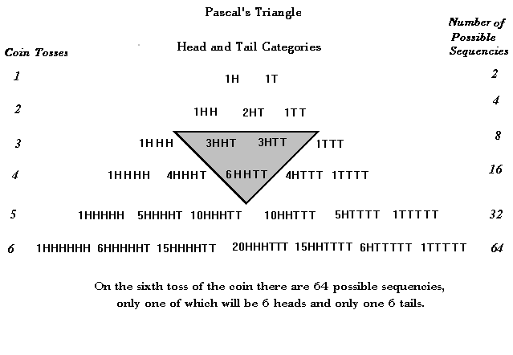
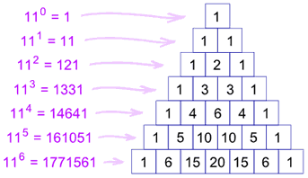
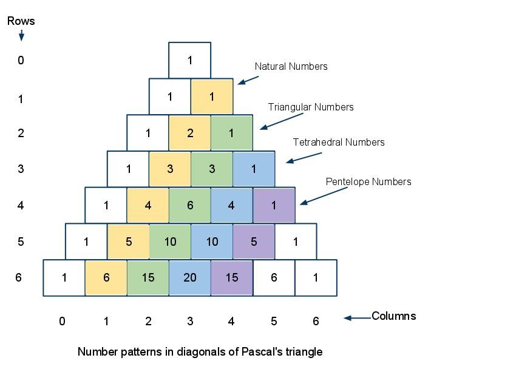
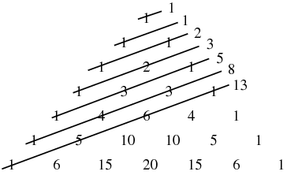

# Binomial Theorem

## Learning Targets

You should be able to
- [ ] Find Binomial Coefficients
- [ ] Expand binomial using Binomial Theorem

## Concepts / Definitions

### Expanding a Binomial

$(a + b)^0 = 1a^0$\
$(a + b)^1 = 1a^1 + 1b^1$\
$(a + b)^2 = 1a^2 + 2ab + 1b^2$\
$(a + b)^3 = 1a^3 + 3a^2b + 3ab^2 + 1b^3$\
$(a + b)^4 = 1a^4 + 4a^3b + 6a^2b^2 + 4ab^3 + 1b^4$\
$(a + b)^5 = 1a^5 + 5a^4b + 10a^3b^2 + 10a^2b^3 + 5ab^4 + 1b^5$

Pascal's triangle corresponds to a value of $_nC_r$

$$_0C_0$$
$$_1C_0\ _1C_1$$
$$_2C_0\ _2C_1\ _2C_2$$
$$_3C_0\ _3C_1\ _3C_2\ _3C_3$$
$$_4C_0\ _4C_1\ _4C_2\ _4C_3\ _4C_4$$
$$_5C_0\ _5C_1\ _5C_2\ _5C_3\ _5C_4\ _5C_5$$

## Binomial Theorem

$$(a + b)^n = \sum_{k=0}^{n} (\binom{n}{k} a^{n-k} b^k$$

$$(a + b)^n = nC_0 a^n b^0 + nC_1 a^{n-1} b^1 + nC_2 a^{n-2} b^2 + ... + nC_{n-1} a^1 b^{n-1} + nC_n a^0 b^n$$

## Pascal's Triangle

