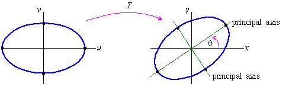
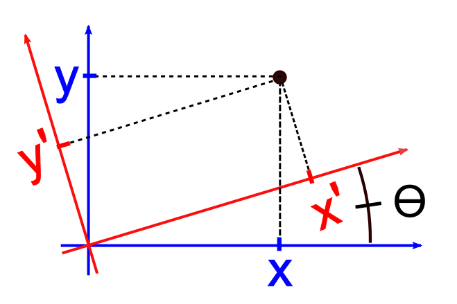



# Classification and Rotation of Conics

## Learning Targets

You should be able to
- [ ] Classify conics
- [ ] Find angle of rotation
- [ ] Write in its transformed form to eliminate the $xy$ term
- [ ] Graph the transformed conic

## Concepts / Definitions

### Classification of Conics

#### The graph of $Ax^2 + Cy^2 + Dx + Ey + F = 0$
If $A = C$ - circle 
If $AC = 0$ - parabola 
If $AC > 0$ - ellipse 
If $AC < 0$ - hyperbola

#### Using the discriminant = $B^2 - 4AC$ 
If $B^2 - 4AC < 0$ - ellipse or circle 
If $B^2 - 4AC = 0$ - parabola 
If $B^2 - 4AC > 0$ - hyperbola

### Rewriting Conics in transformed form

$Ax^2 + Bxy + Cy^2 + Dx + Ey + F = 0$ can be written as $A'x'^2 + C'y'^2 + D'x' + E'y' + F' = 0$ by rotating the axis through an angle $\theta$, where
$$\cot{2\theta} = (\frac{A-C}{B})$$

The coefficients of the new equation are obtained by making the following substitutions. 
$$ x = x' \cos{\theta} - y' \sin{\theta}\ and\ y = x' \sin{\theta} + y' \cos{\theta}$$
