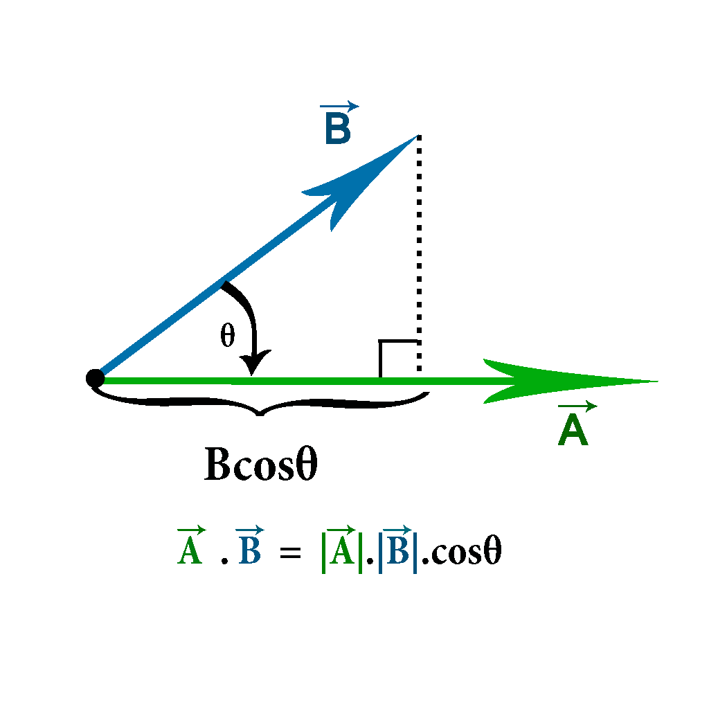

# Dot Product of Vectors in the Plane

## Learning Targets:

You should be able to
- [ ] Find dot products of vectors
- [ ] Find angles between vectors
- [ ] Find work by application

## Concepts / Definitions

### Definition of Dot Product

The **dot product** of $\vec{u} = \langle u_1, u_2 \rangle$ and $\vec{v} = \langle v_1, v_2 \rangle$ is
$$\vec{u} \bullet \vec{v} = u_1 v_1 + u_2 v_2 \qquad \vec{u} \bullet \vec{v} = |\vec{u}| |\vec{v}| \cos{\theta}$$
where $\theta$ is the angle between those vectors.

The dot product is the magnitude amount of stretching / shrinking one vector by another vector, in the same direction of the one vector.

### Orthogonal Vectors

The vectors $\vec{u}$ and $\vec{v}$ are **orthogonal** iff $\vec{u} \bullet \vec{v} = 0$.\
The dot product formula, in terms of the angle, is
$$\cos{\theta} = \frac{\vec{u} \bullet \vec{v}}{|u||v|}$$

<!--Note: replace Note: with PRO TIP-->

Note: Orthogonal and perpendicular are *not exactly* the same. The zero vector is orthogonal to every vector, but not perpendicular to any vector.

### Projection of Vectors

The projection of vector $\vec{u}$ onto vector $\vec{v}$ is
$$proj_{v}u = (\frac{\vec{u} \bullet \vec{v}}{|\vec{v}|^2}) \vec{v} \qquad proj_vu = (\frac{|\vec{u}| |\vec{v}| \cos{\theta}}{|\vec{v}|^2}) \vec{v}$$

Vector $\vec{u}$ as a sum of two orthogonal vectors.
$$\vec{u} = proj_vu + \vec{s},\ \therefore \vec{s} = \vec{u} - proj_vu$$

### Application

If $\vec{F}$ is a constant force whose direction is the same as the direction of $\overrightarrow{AB}$, then the work $W$ done by $\vec{F}$ in moving an object from $A$ to $B$ is $W = |\vec{F}| |\overrightarrow{AB}|$.

$$W = |F|d\cos{\theta}$$
