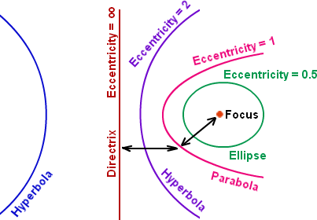



# Eccentricity and Orbits

## Learning Targets

You should be able to
- [ ] Find Eccentricity
- [ ] Find distances related to conics

## Concepts / Definitions

The **eccentricity**, denoted $e$ or $\epsilon$, is a parameter associated with every conic section that can be thought of as a measure of how much the conic section deviates from being circular.

### Formula to find eccentricity values

$$e = \frac{c}{a}$$

### Eccentricity values

Circle: $0$\
Ellipse: $0 < e < 1$\
Parabola: $1$\
Hyperbola: $e > 1$\
Line: $\infty$

### Solar System Data

The *closest point* to the Sun is the **Perihelion**. 
The *farthest point* to the Sun is the **Aphelion**.

*\*Mean distance from the Sun is also the semimajor axis length at the center of the Sun.*

Celestial Object | Mean Distance from Sun $_{(million\ km)}$ | Period of Revolution $_{(d=days)\ (y=years)}$ | Period of Rotation at Equator
:--|--:|--:|--:
THE SUN | --- | --- | 27 d
MERCURY | 57.9 | 88 d | 59 d
VENUS | 108.2 | 224.7 d | 243 d
EARTH | 149.6 | 365.26 d | 23 h 56 min 4 sec
MARS | 227.9 | 687 d | 24 h 37 min 23 sec
JUPITER | 778.4 | 11.9 y | 9 h 50 min 30 sec
SATURN | 1,426.7 | 29.5 y | 10 h 14 min
URANUS | 2,871.0 | 84.0 y | 17 h 14 min
NEPTUNE | 4,498.3 | 164.8 y | 16 h
THE MOON | 149.6 $_{(0.386\ from\ Earth)}$ | 27.3 d | 27.3 d

 

Celestial Object | Eccentricity of Orbit | Equatorial Diameter $_{(km)}$ | Mass $_{(Earth=1)}$ | Density $_{(g/cm^3)}$
:--|--:|--:|--:|--:
THE SUN | --- | 1,392,000 | 333,000.00 | 1.4
MERCURY | 0.206 | 4,879 | 0.06 | 5.4
VENUS | 0.007 | 12,104 | 0.82 | 5.2
EARTH | 0.017 | 12,756 | 1.00 | 5.5
MARS | 0.093 | 6,794 | 0.11 | 3.9
JUPITER | 0.048 | 142,984 | 317.83 | 1.3
SATURN | 0.054 | 120,536 | 95.16 | 0.7
URANUS | 0.047 | 51,118 | 14.54 | 1.3
NEPTUNE | 0.009 | 49,528 | 17.15 | 1.8
THE MOON | 0.055 | 3,476 | 0.01 | 3.3

The **astronomical unit** (AU) is a unit of length that is the average distance of the maximum distance (Aphelion) and the minimum distance (Perihelion).

Celestial Object | Astronomical Unit
:--|:--
MERCURY | 0.387 AU
VENUS | 0.723 AU
EARTH | 1.000 AU
MARS | 1.524 AU
JUPITER | 5.203 AU
SATURN | 9.529 AU
URANUS | 19.19 AU
NEPTUNE | 30.06 AU

Currently, 1 AU = 149,597,870,700 meters, or approximately 149.6 Gm (gigameters).
