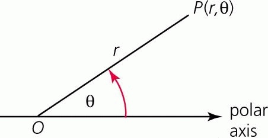



# Intro to Polar coordinates

## Learning Targets

You should be able to
- [ ] Plot polar points
- [ ] Find equivalent polar points to a given point
- [ ] Convert from polar to rectangular and rectangular to polar

## Concepts / Definitions

A polar coordinate system is when points can be graphed from a directed distance and angle. The distance from the pole is called the radical coordinate, or **radius**, and the angle is called the angular coordinate, or **azimuth / polar angle**.

### Polar Coordinate System

The **Pole**: Point $O$ 
The **Polar Axis**: ray from point $O$ along positive x-axis\
The **Polar Coordinates**: $(r, \theta)$

$r$ is directed distance from $O$ 
$\theta$ is directed angle from polar axis

**Polar graphs** are circular. The point $(4, \frac{4 \pi}{3})$ is plotted below. (could also be labeled as $(-4, \frac{\pi}{3})$)

### Examples

If the point $P$ has polar coordinates $(r, \theta)$, **all other polar coordinates** of $P$ must have the form $(r, \theta + 2 \pi n)$ or $(-r, \theta + \pi + 2 \pi n)$ where $n$ is any integer.

### Coordinate Conversions

If the point $P$ has polar coordinates $(r, \theta)$ and rectangular coordinates $(x, y)$, then 
$x = r\cos{\theta}, \qquad y = r \sin{\theta}$ 
$\tan{\theta} = \frac{y}{x}, \qquad x^2 + y^2 = r^2$

### Example
Graph $r=4\cos\theta$, then write the polar equation in rectangular form.

## Exercises

### In class
  1. Find two polar coordinate pairs for the rectangular coordinate point $(-1,1)$
  2. Write $r=4\sec\theta$ in rectangular form

### Homework
  1. For $P(3,\frac{2\pi}{3})$
     1. Plot the point
     2. Convert to exact rectangular coordinates
  2. For $Q(-2,\frac \pi 4)$
     1. Plot the point
     2. Convert to exact rectangular coordinates
  3. For $R(2, \frac \pi 6$
     1. Find another polar coordinate for the point $R$ on the interval $[0,2\pi)$
     2. Find _all_ other polar points.
  4. Convert $(2\sqrt 3,-2)$ to polar form.
  5. Convert $r=-3\sin\theta$ to rectangular form.
  6. Convert $y=5$ to polar form.
  7. Convert $r=2\sin\theta-4\cos\theta$ to rectangular form.
  8. Convert $(x-1)^2+(y+4)^2 = 17$ to polar form.
  9.  The location, given in polar coordinates, of two planes approaching an airport are $(4\ mi,12°)$ and $(2\ mi,72°)$. Find the distance between them.
