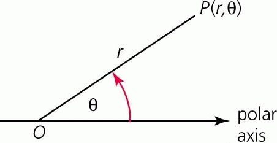

# Intro to Polar coordinates

## Learning Targets

You should be able to
- [ ] Plot polar points
- [ ] Find equivalent polar points to a given point
- [ ] Convert from polar to rectangular and rectangular to polar

## Concepts / Definitions

A polar coordinate system is when points can be graphed from a directed distance and angle. The distance from the pole is called the radical coordinate, or **radius**, and the angle is called the angular coordinate, or **azimuth / polar angle**.

## Polar Coordinate System

The **Pole**: Point $O$\
The **Polar Axis**: ray from point $O$ along positive x-axis\
The **Polar Coordinates**: $(r, \theta)$

$r$ is directed distance from $O$\
$\theta$ is directed angle from polar axis

**Polar graphs** are circular. The point $(4, \frac{4 \pi}{3})$ is plotted below. (could also be labeled as $(-4, \frac{\pi}{3})$)

## Examples

If the point $P$ has polar coordinates $(r, \theta)$, **all other polar coordinates** of $P$ must have the form $(r, \theta + 2 \pi n)$ or $(-r, \theta + \pi + 2 \pi n)$ where $n$ is any integer.

## Coordinate Conversions

If the point $P$ has polar coordinates $(r, \theta)$ and rectangular coordinates $(x, y)$, then

$x = r\cos{\theta}, \qquad y = r \sin{\theta}$\
$\tan{\theta} = \frac{y}{x}, \qquad x^2 + y^2 = r^2$

