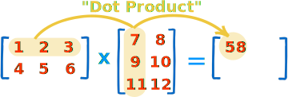

# Matrices

## Learning Targets

You should be able to
- [ ] Know how to algebraically add / subtract / multiply matrices
- [ ] Understand and apply inverse operations with matrices
- [ ] Operations and solving with a graphing calculator

## Concepts / Definitions

### Definition

Let $m$ and $n$ be positive integers. An $m$ by $n$ **matrix** is a rectangular array of $m$ rows by $n$ columns of real numbers.

#### Elements of a Matrix

$m$ = number of rows
$n$ = number of columns
$a_{mn}$ = any element in row $m$ and column $n$
$m \times n$ = dimension of a matrix

$$A = \begin{bmatrix}
    a_{11}&a_{12}&\dots&a_{1n}\\
    a_{21}&a_{22}&\dots&a_{2n}\\
    \vdots&\vdots&\ddots&\vdots\\
    a_{m1}&a_{m2}&\dots&a_{mn}\\
    \end{bmatrix}
$$

### Operations

#### Add / Subtract

Add / subtract corresponding entries, same size matrix.

#### Scalar Multiplication

Multiply each entry by the scalar number, same size matrix.

#### Matrix Multiplication (NOT commutative)

Multiply each row of first by each column of second; need to correspond accordingly and each matrix and answer may not be same size

$$(1)(7) + (2)(9) + (3)(11) = 58$$

### Identity Matrix

$$
I_1 = [1] ,\ I_2 =
\begin{bmatrix}
    1&0\\
    0&1\\
\end{bmatrix}
,\ I_3 =
\begin{bmatrix}
    1&0&0\\
    0&1&0\\
    0&0&1\\
\end{bmatrix}
,\ I_n =
\begin{bmatrix}
    1&0&0&\dots&0\\
    0&1&0&\dots&0\\
    \vdots&\vdots&\vdots&\ddots&\dots\\
    0&0&0&\dots&1\\
\end{bmatrix}
$$

$AB \ =
    \begin{bmatrix}
        \ \ \ 3&\ \ \ 4\\
        -1&-1\\
    \end{bmatrix}
    \begin{bmatrix}
        -1&-4\\
        \ \ \ 1&\ \ \ 3\\
    \end{bmatrix}
$\
$\qquad =
    \begin{bmatrix}
        (3*-1)+(4*1)&(3*-4)+(4*3)\\
        (-1*-1)+(-1*1)&(-1*-4)+(-1*3)\\
    \end{bmatrix}
$\
$\qquad =
    \begin{bmatrix}
        -3+4&-12+12\\
        1+-1&4+-3\\
    \end{bmatrix}
$\
$\qquad =
    \begin{bmatrix}
        1&0\\
        0&1\\
    \end{bmatrix}
$

### Determinants for 2x2 and 3x3

$$A =
\begin{bmatrix}
    a&b\\
    c&d\\
\end{bmatrix}
\quad |A| = ad - bc
$$

$
    \begin{vmatrix}
        a&b&c\\
        d&e&f\\
        g&h&i\\
    \end{vmatrix}
$
$\; =\ a
    \begin{vmatrix}
        e&f\\
        h&i\\
    \end{vmatrix}
$
$-\ b
    \begin{vmatrix}
        d&f\\
        g&i\\
    \end{vmatrix}
$
$+\ c
    \begin{vmatrix}
        d&e\\
        g&h\\
    \end{vmatrix}
$\
$\qquad \qquad \qquad = a(ei-fh) - b(di-fg) + c(dh-eg)$\
$\qquad \qquad \qquad = aei - afh - bdi - + bfg + cdh - ceg$\
$\qquad \qquad \qquad = (aei + bfg + cdh) - (afh + bdi + ceg)$

### Inverse Matrices

$$
A^{-1} =
\begin{bmatrix}
    a&b\\
    c&d\\
\end{bmatrix}^{-1}
= \frac{1}{ad-bc}
\begin{bmatrix}
    d&-b\\
    -c&a\\
\end{bmatrix}
$$

$$
A^{-1} = \frac{1}{|A|}
\begin{bmatrix}
    \begin{bmatrix}
        a_{22}&&a_{23}\\
        a_{32}&&a_{33}\\
    \end{bmatrix}&
    \begin{bmatrix}
        a_{13}&&a_{12}\\
        a_{33}&&a_{32}\\
    \end{bmatrix}&
    \begin{bmatrix}
        a_{12}&&a_{13}\\
        a_{22}&&a_{23}\\
    \end{bmatrix}\\

    \begin{bmatrix}
        a_{23}&&a_{21}\\
        a_{33}&&a_{31}\\
    \end{bmatrix}&
    \begin{bmatrix}
        a_{11}&&a_{13}\\
        a_{31}&&a_{33}\\
    \end{bmatrix}&
    \begin{bmatrix}
        a_{13}&&a_{11}\\
        a_{23}&&a_{21}\\
    \end{bmatrix}\\

    \begin{bmatrix}
        a_{21}&&a_{22}\\
        a_{31}&&a_{31}\\
    \end{bmatrix}&
    \begin{bmatrix}
        a_{12}&&a_{11}\\
        a_{32}&&a_{31}\\
    \end{bmatrix}&
    \begin{bmatrix}
        a_{11}&&a_{12}\\
        a_{21}&&a_{22}\\
    \end{bmatrix}\\
\end{bmatrix}
$$

$$A x A^{-1} = I$$

$$
\begin{bmatrix}
    1&2&3\\
    4&5&6\\
    7&8&9\\
\end{bmatrix}
\times
\begin{bmatrix}
    \ &\ &\ \\
    \ &\ &\ \\
    \ &\ &\ \\
\end{bmatrix}
=
\begin{bmatrix}
    1&0&0\\
    0&1&0\\
    0&0&1\\
\end{bmatrix}
$$

### Solving a Matrix Equation

$AX = B$ Given; since A is $n \times n$, $X$ must by $n \times p$\
$A^{-1}(AX) = A^{-1}B$ Multiply on the left by $A^{-1}$\
$(A^{-1}A)X = A^{-1}B$ Associative property of matrices\
$(I_n)X = A^{-1}B$ Property of matrix inverses\
$X = A^{-1}B$ Property of the identity matrix

#### Solving Example

$$a + b + c = -5$$
$$9a + 3b + c = 5$$
$$16a + 4b + c = 16$$

$$
[A]
\begin{bmatrix}
    a\\
    b\\
    c\\
\end{bmatrix}
= [B] \implies
\begin{bmatrix}
    a\\
    b\\
    a\\
\end{bmatrix}
= [A]^{-1}[B]
$$

$$
\begin{matrix}
    a+b+c=-5\\
    9a+3b+c=5\\
    16a+4b+c=16\\
\end{matrix}
\implies
\begin{bmatrix}
    1&1&1\\
    9&3&1\\
    16&4&1\\
\end{bmatrix}
\begin{bmatrix}
    a\\
    b\\
    c\\
\end{bmatrix}
=
\begin{bmatrix}
    -5\\
    5\\
    16\\
\end{bmatrix}
$$
