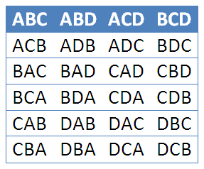

# Permutations and Combinations

## Learning Targets

You should be able to
- [ ] Apply Fundamental Counting Principle
- [ ] Apply Permutations
- [ ] Apply Combinations

## Concepts / Definitions

The **Fundamental Counting Principle** states that if one event has $m$ possible outcomes and a second independent event has $n$ possible outcomes, then there are **$m$ x $n$ total possible outcomes** for the two events together.

If you have four flavors of ice cream and two types of cones, then ther are $4 * 2 = 8$ possible combinations.

In mathematics, the **factorial** of a non-negative integer $n$, denoted by $n!$, is the product of all positive integers less than or equal to $n$.

$$n! = n(n-1)(n-2)(n-3)\ ...\ (2)(1)$$

By definition, $0! = 1$.

**Permutations** are the number of ways a set of $n$ distinguishable objects can be *arranged in order*.\
$4!$ = 24 ways to order four items

The number of permutations on $n$ objects taken $r$ at a time is given by

$$P\binom{n}{r} = P(n, r) = nPr = \frac{n!}{(n-r)!}$$

The number of ways $n$ items can be *ordered with replacement $r$* times is **$n^r$**

$\frac{4!}{(4-3)!}$ = 24 ways of selecting and ordering 3 or 4 letters, but only 4 ways if order does not matter.

**Combinations** are the number of ways selecting $r$ items from a group of $n$ items where *order does not matter*.\
**To take out all the ways $r$ can happen, we divide out all the ways $r!$ can happen.**\
The number of combinitions of $n$ objects taken $r$ at a time is given by

$$C\binom{n}{r} = C(n, r) = nCr = \frac{n!}{r!(n-r)!}$$

$\implies$ Also called $n$ choose $k$, noted \binom{n}{k} = \frac{n!}{k!(n-k)!}$

**Counting Subsets of an $n$-Set**\
Consider a binomial situation, where there is a yes or no, success or failure, possibility happening $n$ times. The number of ways this can happen is $2^n$. There are $2^n$ subsets of a set with $n$ objects.
