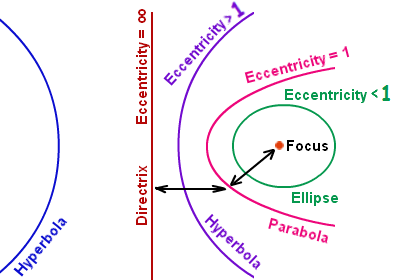

# Polar Equations of Conics

## Learning Targets

You should be able to
- [ ] Identify Conics
- [ ] Graph Conics from polar form
- [ ] Write polar to / from rectangular

## Concepts / Definitions

Any conic section can be defined as the locus of points whose distances to a point (the focus) and a line (the directrix) have a *constant ratio*. That ratio is the eccentricity, denoted as $e$.\
if $0 < e < 1$, the conic is an ellipse\
if $e = 1$, the conic is a parabola\
if $e > 1$, the conic is a hyperbola

### Derivation

For any point $P(x, y)$ on the curve $D(x, y)$ on the directrix and $F(x, y)$ the focus at pole, the ratio of $PF/PD$ equals the eccentricity. $k$ is the distance between the focus and directrix.

$$e = \frac{PF}{PD} \Rightarrow PF = e * PD$$

### Polar form of Conic Definition

The graph of a conic in polar form, with *focus at pole*, is given by
$$r = \frac{ek}{1 \pm e \cos{\theta}}\ or\ r = \frac{ek}{1 \pm e \sin{\theta}}$$
where $e$ = eccentricity, and $k$ is the distance between the focus and directrix.\
The directrix is perpendicular to the major axis, the axis of symmetry, and the transverse axis.

$$e = \frac{distance\ to\ focus}{distance\ to\ directrix} = \frac{PF}{PD} = \frac{c}{a}$$

$\cos{\theta}$ has polar axis symmetry and $\sin{\theta}$ has $\theta = \frac{\pi}{2}$ symmetry.

$r = \frac{ek}{1 + e\cos{\theta}}$ vertical directrix right of the pole\
$r = \frac{ek}{1 - e\cos{\theta}}$ vertical directrix left of the pole\
$r = \frac{ek}{1 + e\sin{\theta}}$ horizontal directrix above the pole\
$r = \frac{ek}{1 - e\sin{\theta}}$ horizontal directrix below the pole
