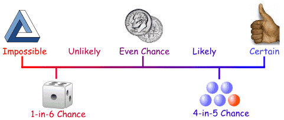
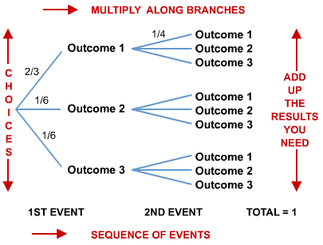
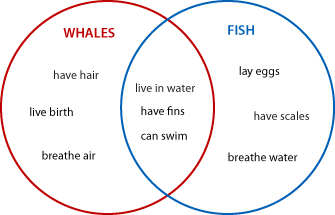
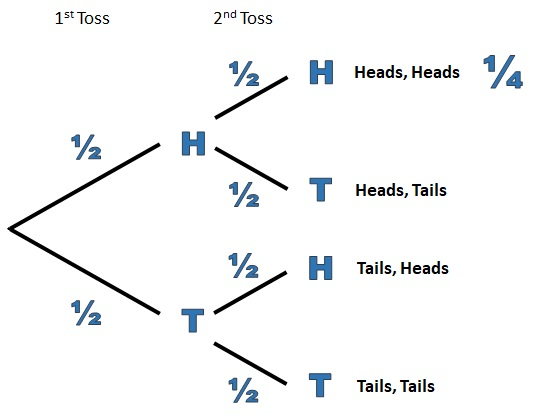
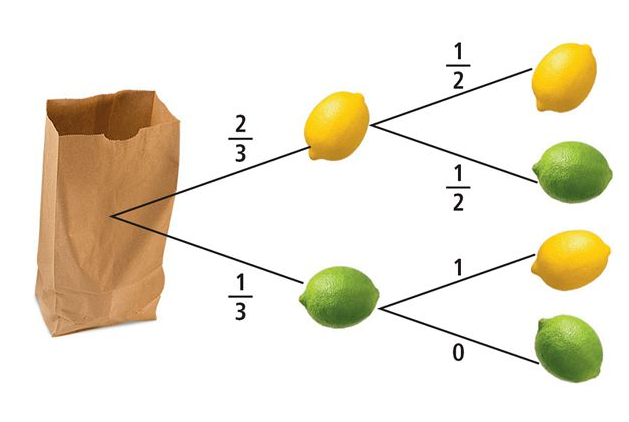



# Probability

## Learning Targets

You should be able to
- [ ] Apply probabilities

## Concepts / Definitions

If $E$ is an event in a finite, nonempty sample space $S$ of equally likely outcomes, then the probability of the event $E$ is
$$P(E) = \frac{the\ number\ of\ outcomes\ in\ E}{the\ number\ of\ outcomes\ in\ S}$$
(If not equally likely outcomes, add up all the probabilities of all outcomes)

A **probability function** is a function $P$ that assigns a real number to each outcome in a sample space $S$ subject to the following conditions:
1. $0 \leq P(O) \leq 1$ for every outcome O
2. The sum of the probabilities of all outcomes in $S$ is 1
3. $P(\varnothing) = 0$\
($\varnothing$ is the empty set; set with no elements / solutions)

The union symbol $\cup$ means "or" (add probabilities).\
The intersection symbol $\cap$ means "and" (multiply probabilities).

### Tree diagram for sequence of events

### Venn Diagram for inclusive events

Events are **independent events** if the occurrence of one event does not affect the probability of the other.

Events are **dependent events** if the occurrence of one event affects the probability of the other.

### Conditional Probability

If the event $B$ depnds on the event $A$, then
$$P(B|A) = \frac{P(A\ and\ B)}{P(A)}$$
and
$$P(A\ and\ B) = P(A) * P(B|A)$$

### Binomial Probability

If a binomial experiment has $n$ trials in which $p$ is the probability of success and $q = 1 - p$ is the probability of failure in any given trial, the **the binomial probability** that there will be exactly $r$ successes is
$$P(r) = _nC_r p^r q^{n-r}$$
