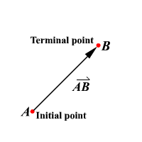

# Vectors in the Plane

## Learning Targets

You should be able to
- [ ] Write 2D vectors and find unit vectors and magnitudes
- [ ] Perform operations of vectors
- [ ] Solve applications including force and direction of objects

## Concepts / Definitions

A **two dimensional vector** is an ordered pair of real numbers, denoted in component form as $\vec{v} = \langle a, b\rangle$. The numbers $a$ and $b$ and the components. If an arrow has initial point $A(x_1, y_1)$ and terminal point $(x_2, y_2)$, it represents the vector in component form $\overrightarrow{AB} = \langle x_2 - x_1, y_2 - y_1 \rangle$

### Magnitude

The magnitude of $\vec{v}$ is the length of the arrow and the direction of $\vec{v}$ is the direction in which the arrow is pointing.

The **magnitude of vector** $\vec{v} = \langle v_1, v_2 \rangle$, represented by $\overrightarrow{AB}$ is
$$|v| = \sqrt{(x_2 - x_1)^2 + (y_2 - y_1)^2} = \sqrt{(v_1)^2 + (v_2)^2}$$

### Unit Vector

The **unit vector** $\vec{u}$ is a vector with length $|u| = 1$.
$$\vec{u} = \frac{1}{|v|}\vec{v}$$

### Linear combination of a vector ($\hat{\imath} \hat{\jmath}$ form)

Two component unit vectors are represented by ($\hat{\imath}$ hat and $\hat{\jmath}$ hat). $\hat{\imath} = \langle 1, 0 \rangle$ and $\hat{\jmath} = \langle 0, 1 \rangle$. The linear combination of a vector $\vec{v}$ is
$$\vec{v} = \langle a, b \rangle = ai + bj$$

### Operations (answer is called resultant)

The sum or difference of vectors $\vec{a} \pm \vec{b}$ is $\vec{a} \pm \vec{b} = \langle a_1 \pm b_1, a_2 \pm b_2 \rangle$

The product of the scalar $k$ and the vector $\vec{v}$ is $k\vec{a} = \langle ka_1, ka_2 \rangle$

### Trigonometric form and direction angle of vectors

If $\vec{v}$ has direction angle $\theta$, the components of $\vec{v}$ can be computed $\vec{v} = \langle |v|cos{\theta}, |v|\;sin{\theta} \rangle$ and the unit vector in the direction of $\vec{v}$ is $\vec{u} = \langle cos{\theta}, sin{\theta} \rangle$

### Application

Weight force, $F_{g}$ directly downward, can be calculated by multiplying the mass by the acceleration.

SI units: $Newtons = kg * 9.8m/s^2$\
American units: $Pounds = slugs * 32ft/s^2$
